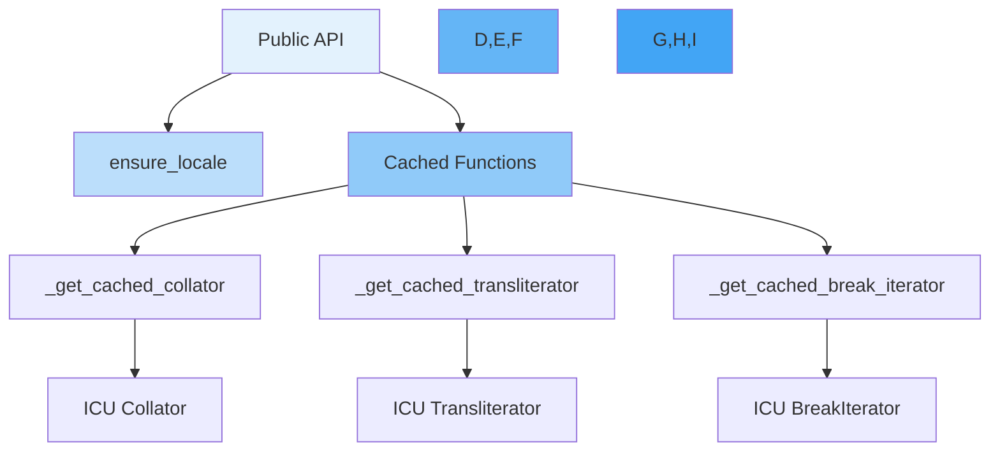

# uicu._utils

Internal utilities module (private API).

This module contains internal utility functions used by UICU. These functions are not part of the public API and may change without notice.

## Overview

The `_utils` module provides:
- Locale conversion utilities
- Performance optimization through caching
- Shared helper functions

**Warning**: This is an internal module. Use at your own risk. The functions here are subject to change without notice.

## Functions

### `ensure_locale`

::: uicu._utils.ensure_locale

## Cached ICU Object Creation

The module includes several cached functions for creating expensive ICU objects:

### `_get_cached_collator`

Creates and caches ICU Collator instances for better performance.

```python
# Internal use only
from uicu._utils import _get_cached_collator

# This function is used internally by the Collator class
# to avoid recreating expensive ICU objects
```

### `_get_cached_transliterator`

Creates and caches ICU Transliterator instances.

```python
# Internal use only
from uicu._utils import _get_cached_transliterator

# Used internally by the Transliterator class
# for performance optimization
```

### `_get_cached_break_iterator`

Creates and caches ICU BreakIterator instances for text segmentation.

```python
# Internal use only
from uicu._utils import _get_cached_break_iterator

# Used internally by segmentation classes
# to reuse break iterators
```

## Performance Impact

The caching functions in this module significantly improve performance:

```python
# Without caching (conceptual example)
for i in range(1000):
    collator = icu.Collator.createInstance(locale)  # Expensive!
    result = collator.sort(data)

# With caching (what UICU does internally)
for i in range(1000):
    collator = get_cached_collator(locale_id, ...)  # Fast!
    result = collator.sort(data)
```

## Why Internal?

This module is internal because:

1. **Implementation Details**: The caching strategy may change
2. **ICU Dependency**: Direct ICU object handling
3. **API Stability**: Public API provides stable interfaces
4. **Type Safety**: Public API provides better type checking

## Using Public API Instead

Instead of using internal utilities, use the public API:

```python
# ❌ Don't use internal utilities
from uicu._utils import _get_cached_collator
collator = _get_cached_collator('en-US', ...)

# ✅ Use public API
import uicu
collator = uicu.Collator('en-US')  # Caching happens internally
```

## Cache Statistics

The caching functions use `functools.lru_cache`, which provides cache statistics:

```python
# For debugging/development only
from uicu._utils import _get_cached_collator

# Check cache statistics
info = _get_cached_collator.cache_info()
print(f"Cache hits: {info.hits}")
print(f"Cache misses: {info.misses}")
print(f"Cache size: {info.currsize}")

# Clear cache if needed (not recommended in production)
_get_cached_collator.cache_clear()
```

## Internal Architecture



## Contributing

If you're contributing to UICU:

1. **Maintain Cache Consistency**: Don't modify cached objects
2. **Thread Safety**: Cached objects should be read-only
3. **Memory Limits**: Keep cache sizes reasonable
4. **Clear Documentation**: Document any new utilities

## Future Considerations

The internal utilities may be expanded to include:
- Additional caching strategies
- Performance monitoring
- Memory management utilities
- Debug helpers

However, these will remain internal implementation details.

## See Also

- [Developer Guide](../development/index.md) - For contributors
- [Architecture](../development/architecture.md) - System design
- Public API modules for stable interfaces