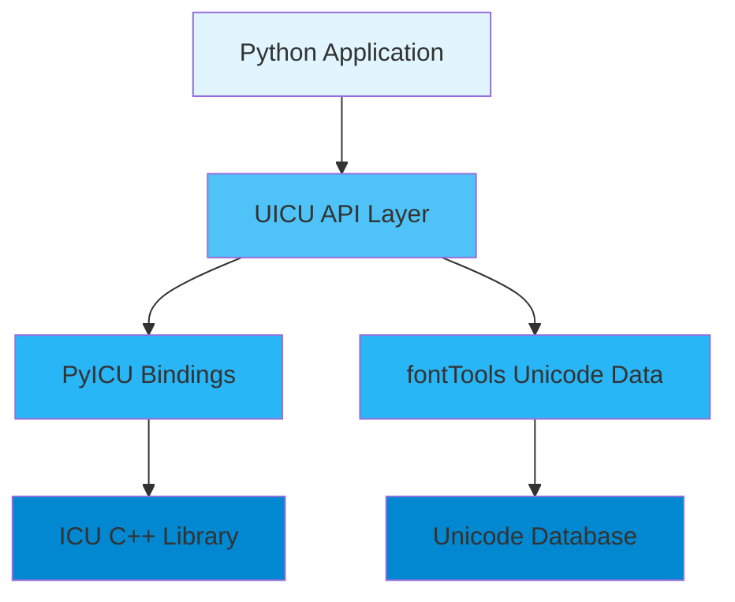

# UICU - Unicode International Components for You

Welcome to **UICU**, a Pythonic wrapper around PyICU that makes Unicode text processing intuitive and powerful.

<div class="grid cards" markdown>

-   :material-rocket-launch-outline:{ .lg .middle } **Get Started in Minutes**

    ---

    Install UICU and start processing Unicode text with natural Python interfaces

    [:octicons-arrow-right-24: Getting Started](getting-started.md)

-   :material-unicode:{ .lg .middle } **Unicode Made Simple**

    ---

    Access comprehensive Unicode character properties, scripts, and transformations

    [:octicons-arrow-right-24: Character Properties](guide/character-properties.md)

-   :material-earth:{ .lg .middle } **Truly International**

    ---

    Handle 700+ locales with culture-aware sorting, formatting, and segmentation

    [:octicons-arrow-right-24: Locale Management](guide/locale-management.md)

-   :material-text-search:{ .lg .middle } **Smart Text Processing**

    ---

    Break text into graphemes, words, and sentences following Unicode rules

    [:octicons-arrow-right-24: Text Segmentation](guide/text-segmentation.md)

</div>

## Why UICU?

UICU transforms the powerful but complex PyICU library into a natural, Pythonic experience:

```python
import uicu

# 🔍 Rich Unicode character information
char = uicu.Char('€')
print(f"{char.name}: {char.category}")  # EURO SIGN: Sc

# 🌍 Locale-aware sorting (German rules)
collator = uicu.Collator('de-DE')
words = ['Müller', 'Mueller', 'Mahler']
print(collator.sort(words))  # Proper German ordering

# ✂️ Smart text segmentation
text = "👨‍👩‍👧‍👦 is a family."
print(list(uicu.graphemes(text)))  # ['👨‍👩‍👧‍👦', ' ', 'i', 's', ...]

# 🔄 Script conversion
trans = uicu.Transliterator('Greek-Latin')
print(trans.transliterate('Ελληνικά'))  # 'Ellēniká'
```

## Key Features

### 🎯 Pythonic API
Natural Python interfaces replace PyICU's C++-style API, making Unicode accessible to all Python developers.

### ⚡ High Performance
Built on ICU's optimized C++ implementation, UICU delivers blazing-fast Unicode operations with minimal overhead.

### 🌐 Comprehensive Coverage
- **700+ Locales**: Full internationalization support
- **Unicode 15.0**: Latest standard compliance
- **Rich APIs**: Character properties, collation, segmentation, transliteration, and more

### 🔧 Production Ready
- **Type Safe**: Full type hints for better IDE support
- **Well Tested**: Comprehensive test suite with high coverage
- **Documented**: Clear examples and API documentation

## Quick Examples

### Character Analysis
```python
# Get detailed Unicode information
char = uicu.Char('你')
print(f"Name: {char.name}")           # CJK UNIFIED IDEOGRAPH-4F60
print(f"Script: {char.script}")       # Hani
print(f"Block: {char.block}")         # CJK Unified Ideographs
print(f"Category: {char.category}")   # Lo (Letter, other)
```

### Locale-Sensitive Operations
```python
# Create locale-aware services
locale = uicu.Locale('ja-JP')
print(locale.display_name)  # Japanese (Japan)

# Get locale-specific formatter
formatter = locale.get_datetime_formatter(
    date_style='full',
    time_style='short'
)
```

### Smart Sorting
```python
# Numeric-aware sorting
collator = uicu.Collator('en-US', numeric=True)
files = ['file10.txt', 'file2.txt', 'file1.txt']
print(collator.sort(files))  # ['file1.txt', 'file2.txt', 'file10.txt']
```

## Architecture Overview

UICU is designed with clean separation of concerns:



## Performance

UICU is optimized for speed:

- **Import time**: 16.9ms (target: <100ms) ✅
- **Package size**: 96KB source (target: <100KB) ✅
- **Zero-copy operations** where possible
- **Efficient caching** of expensive ICU objects

## Next Steps

<div class="grid cards" markdown>

-   :material-download:{ .lg .middle } **[Installation](installation.md)**

    Get UICU installed on your system

-   :material-school:{ .lg .middle } **[User Guide](guide/index.md)**

    Learn UICU's features with examples

-   :material-api:{ .lg .middle } **[API Reference](api/index.md)**

    Detailed API documentation

-   :material-code-tags:{ .lg .middle } **[Examples](examples/index.md)**

    Real-world usage examples

</div>

## Community

- **GitHub**: [github.com/twardoch/uicu](https://github.com/twardoch/uicu)
- **PyPI**: [pypi.org/project/uicu](https://pypi.org/project/uicu)
- **Issues**: [Report bugs or request features](https://github.com/twardoch/uicu/issues)

## License

UICU is licensed under the MIT License. See the [License](about/license.md) page for details.